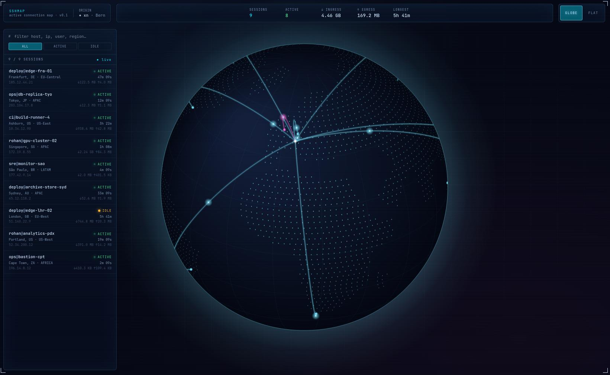

# sshmap

Visualizes your active SSH connections on a world map. Shows where each session is coming from, how long it's been running, and what command is active.



## Requirements

- Java 11+
- [Clojure CLI](https://clojure.org/guides/install_clojure)
- Linux (`ss`) or macOS (`lsof`)

## Run

```sh
clj -M:run
```

Opens at `http://localhost:7070`.

### Options

```
-p, --port PORT   Listen on a different port
-d, --demo        Use sample data instead of live SSH detection
-h, --help
```

### Config file (optional)

`~/.sshmap.edn` — override defaults or pin your origin location:

```edn
{:port 8080
 :origin {:id "origin" :label "home-lab" :city "Berlin" :country "DE" :lat 52.52 :lng 13.41}}
```

Without a config file, your location is auto-detected via ip-api.com.
